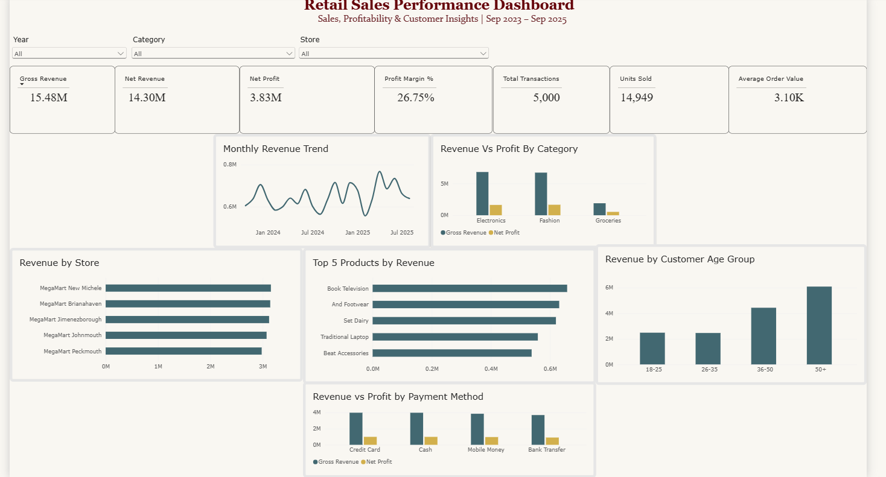

# Retail Sales Analytics | Excel, SQL & Power BI

## Project Overview

This project analyzes retail sales transaction data to identify trends in revenue, profitability, product performance, store performance, customer segments, and payment behavior.

The analysis follows an end-to-end data analytics workflow using **Excel, MySQL, and Power BI**. Excel was used for initial data preparation and exploratory analysis, MySQL for data validation and business-focused SQL analysis, and Power BI for data modeling, DAX calculations, and interactive dashboard development.

## Business Objectives

The analysis aims to answer the following questions:

- How are revenue and profitability performing across product categories?
- How does sales performance change over time?
- Which stores generate the highest revenue?
- Which products contribute the most revenue?
- Which customer age segments contribute the most to sales?
- How does performance vary across payment methods?
## Dataset Structure

The dataset contains **5,000 retail transactions** covering the period from **September 2023 to September 2025**.

The data is organized into four tables:

| Table | Description |
|---|---|
| Transactions | Fact table containing transaction date, customer, product, store, quantity, discount, and payment method |
| Customers | Customer demographic information including gender, birth date, city, and join date |
| Products | Product information including category, subcategory, unit price, and cost price |
| Stores | Store information including store name, city, and region |

## Data Model

A **star schema** was used for the analysis, with `Transactions` as the central fact table and `Customers`, `Products`, and `Stores` as dimension tables.

- `Customers[CustomerID]` → `Transactions[CustomerID]`
- `Products[ProductID]` → `Transactions[ProductID]`
- `Stores[StoreID]` → `Transactions[StoreID]`

Each dimension table has a **one-to-many (1:*) relationship** with the Transactions table.
## Tools & Analytical Workflow

### Excel
- Reviewed and prepared the raw dataset for analysis
- Created calculated fields for revenue and profitability
- Used PivotTables to analyze category, store, customer, monthly, and payment trends
- Performed initial exploratory data analysis and validated key metrics

### MySQL
- Imported and structured the retail dataset in a relational database
- Performed data quality checks for null values, duplicates, and valid ranges
- Used JOINs to combine fact and dimension tables
- Applied GROUP BY, aggregate functions, CASE statements, date functions, and window functions
- Analyzed category, monthly, store, customer, payment, and product performance

### Power BI
- Built a star-schema data model with one-to-many relationships
- Created DAX measures for revenue, profit, margin, transactions, units sold, and average order value
- Created customer age segments using DAX
- Developed an interactive dashboard with slicers for Year, Category, and Store
- Cross-validated key Power BI results against Excel and SQL
## Key Insights

- **Gross Revenue:** 15.48M across 5,000 transactions and 14,949 units sold.
- **Net Revenue:** 14.30M, generating **3.83M in Net Profit** with a profit margin of approximately **26.75%**.
- **Category Performance:** Electronics generated the highest gross revenue at approximately **6.84M**, while Fashion generated the highest net profit at approximately **1.66M**.
- **Profitability:** Groceries recorded the highest profit margin at approximately **30.44%**, despite generating the lowest overall revenue.
- **Monthly Performance:** Among complete months, **April 2025** recorded the highest gross revenue at approximately **767.55K**, while **February 2025** recorded the lowest at approximately **556.69K**.
- **Store Performance:** MegaMart New Michele generated the highest gross revenue at approximately **3.16M**.
- **Customer Segmentation:** The **50+ age segment** generated the highest revenue and net profit.
- **Payment Behavior:** Credit Card generated the highest revenue and net profit, while Cash recorded the highest number of transactions.
- **Product Performance:** Book Television was the highest revenue-generating product at approximately **658.04K**.

> **Note:** September 2023 and September 2025 contain partial-month data. They were excluded when comparing complete monthly performance to avoid misleading conclusions.


## Power BI Dashboard

The interactive Power BI dashboard provides an overview of revenue, profitability, transaction activity, customer segments, store performance, product performance, and payment behavior.




## Key Metrics

| Metric | Result |
|---|---:|
| Gross Revenue | 15.48M |
| Net Revenue | 14.30M |
| Net Profit | 3.83M |
| Profit Margin | 26.75% |
| Transactions | 5,000 |
| Units Sold | 14,949 |
| Average Order Value | 3.10K |


## Project Structure

```text
Retail-Sales-Analytics/
│
├── data/
│   └── retail_sales_dataset_Raw.xlsx
│
├── excel/
│   └── Retail Sales Analysis.xlsx
│
├── sql/
│   └── retail_sales_analysis.sql
│
├── powerbi/
│   └── Retail_Sales_Analytics_Dashboard.pbix
│
├── images/
│   └── retail_sales_dashboard.png
│
└── README.md
